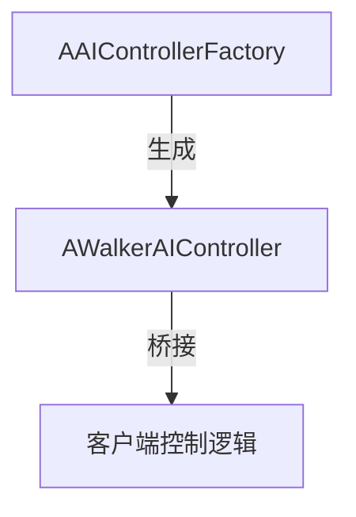

# CARLA AI 控制器模块说明文档

## 文件概览
本文档说明以下三个关键文件在CARLA仿真平台中的实现：

1. **AIControllerFactory.h** - AI控制器工厂类声明
2. **AIControllerFactory.cpp** - AI控制器工厂实现
3. **WalkerAIController.h** - 步行者AI控制器类定义


---

## 概述
CARLA 的 AI 控制器模块用于在仿真环境中创建和管理由 AI 驱动的实体。该模块是实现自动驾驶车辆和行人等自主代理的关键，提供了生成和控制这些代理的基础设施。通过提供的代码文件（`AIControllerFactory.cpp`、`AIControllerFactory.h` 和 `WalkerAIController.h`），可以生成特定的 AI 控制器，尤其是用于行人代理的控制器。

## 关键概念

### AI 控制器工厂
`AAIControllerFactory` 类作为生成 AI 控制器演员的工厂。它继承自 `ACarlaActorFactory`，并实现了定义和生成 AI 控制器演员所需的方法。

### 行人 AI 控制器
`AWalkerAIController` 类表示专为行人代理设计的 AI 控制器。该类继承自 `AActor`，负责管理仿真中行人实体的行为和逻辑。

## 架构

### 类层次结构
- `AAIControllerFactory`（继承自 `ACarlaActorFactory`）
  - 负责生成 AI 控制器定义并实例化 AI 控制器演员。
- `AWalkerAIController`（继承自 `AActor`）
  - 实现行人的 AI 控制器功能。

### 工作流程
1. **定义**：工厂类（`AAIControllerFactory`）提供在 CARLA 环境中可以实例化的 AI 控制器类型定义。
2. **实例化**：当需要 AI 控制器时，调用工厂的 `SpawnActor` 方法，传入适当的变换和描述参数，在游戏世界中创建控制器。
3. **控制器初始化**：`AWalkerAIController` 类初始化行人控制器，设置必要的组件和配置。


## 使用指南

### 集成 AI 控制器
1. **包含头文件**：在需要 AI 控制器功能的项目文件中包含必要的头文件（`AIControllerFactory.h` 和 `WalkerAIController.h`）。
2. **工厂初始化**：实例化 `AAIControllerFactory` 以访问 AI 控制器定义和生成能力。
3. **生成控制器**：使用工厂的 `SpawnActor` 方法，传入适当的变换和描述，在运行时创建 AI 控制器。

### 自定义 AI 行为
- 修改 `AWalkerAIController` 类以实现特定的行人行为，例如导航逻辑、动画控制和与环境的交互。
- 如果需要额外的 AI 控制器类型，扩展工厂类，遵循为行人控制器建立的模式。

## 1. AIControllerFactory.h

### 类定义
```cpp
class CARLA_API AAIControllerFactory final : public ACarlaActorFactory
```

### 功能描述
- **核心作用**：AI控制器工厂类，专用于生成和管理AI控制器Actor
- **继承关系**：继承自CARLA Actor工厂基类 `ACarlaActorFactory`
- **UE集成**：通过 `UCLASS()` 宏支持Unreal Engine反射系统
- **工厂模式**：实现标准化AI控制器生成流程

### 关键方法
| 方法签名                                                                 | 功能说明                                                                 |
|--------------------------------------------------------------------------|--------------------------------------------------------------------------|
| `TArray<FActorDefinition> GetDefinitions() final;`                       | 返回支持的AI控制器类型定义集合                                           |
| `FActorSpawnResult SpawnActor(const FTransform&, const FActorDescription&) final;` | 根据指定位置和描述信息生成AI控制器实例                                   |

### 设计要点
- **final修饰**：禁止进一步派生
- **强类型接口**：使用Unreal Engine原生类型(`FTransform`, `FActorDescription`等)

---

## 2. AIControllerFactory.cpp

### 实现细节

#### GetDefinitions()
```cpp
TArray<FActorDefinition> AAIControllerFactory::GetDefinitions()
{
  auto WalkerController = UActorBlueprintFunctionLibrary::MakeGenericDefinition(
      TEXT("controller"), TEXT("ai"), TEXT("walker"));
  WalkerController.Class = AWalkerAIController::StaticClass();
  return { WalkerController };
}
```
- **功能**：定义工厂支持的AI控制器类型
- **关键点**：
  - 使用`MakeGenericDefinition`创建基础定义
  - 指定控制器类为`AWalkerAIController`

#### SpawnActor()
```cpp
FActorSpawnResult AAIControllerFactory::SpawnActor(
    const FTransform& Transform,
    const FActorDescription& Description)
{
  // 错误检查
  if (World == nullptr) {
    UE_LOG(LogCarla, Error, TEXT("Cannot spawn in empty world"));
    return {};
  }
  
  // 生成参数配置
  FActorSpawnParameters SpawnParams;
  SpawnParams.SpawnCollisionHandlingOverride = ESpawnActorCollisionHandlingMethod::AlwaysSpawn;
  
  // 实际生成
  auto* Controller = World->SpawnActor<AActor>(Description.Class, Transform, SpawnParams);
  return FActorSpawnResult{Controller};
}
```
- **功能**：实际生成AI控制器实例
- **关键点**：
  - 严格的空世界检查
  - 强制忽略碰撞的生成策略
  - 完整的错误日志记录

---

## 3. WalkerAIController.h

### 类定义
```cpp
class CARLA_API AWalkerAIController : public AActor
```

### 功能描述
- **核心作用**：步行者AI的轻量级控制器占位
- **继承关系**：直接继承自`AActor`而非`AController`
- **设计理念**：最小化资源占用，作为客户端控制的桥接

### 关键实现
```cpp
AWalkerAIController(const FObjectInitializer& ObjectInitializer)
  : Super(ObjectInitializer)
{
  PrimaryActorTick.bCanEverTick = false; // 禁用Tick
  RootComponent = CreateDefaultSubobject<USceneComponent>(TEXT("RootComponent"));
  RootComponent->bHiddenInGame = true;   // 隐藏根组件
}
```

### 特性说明
| 特性                  | 作用                                                                 |
|-----------------------|----------------------------------------------------------------------|
| **禁用Actor Tick**    | 减少CPU消耗                                                         |
| **隐藏根组件**        | 使用`USceneComponent`作为占位，避免渲染开销                         |
| **轻量化设计**        | 仅保留必要组件，适合大规模AI场景                                    |

---

## 模块协作关系


1. **工厂创建**：`AAIControllerFactory`生成`AWalkerAIController`实例
2. **轻量控制**：生成的控制器作为客户端控制的代理
3. **高效管理**：通过禁用Tick和隐藏组件优化性能

---

## 使用示例

### 生成AI控制器
```cpp
// 获取工厂实例
auto* Factory = GetWorld()->SpawnActor<AAIControllerFactory>();

// 生成Walker控制器
FTransform SpawnTransform;
FActorDescription Desc;
Desc.Class = AWalkerAIController::StaticClass();
auto Result = Factory->SpawnActor(SpawnTransform, Desc);
```

### 典型应用场景
- 自动驾驶行人模拟
- 大规模人群仿真
- 需要轻量级AI控制的场景

---
## 总结
CARLA 的 AI 控制器模块提供了一个灵活且可扩展的框架，用于创建和管理由 AI 驱动的实体。通过使用工厂模式和专用控制器类，开发者可以高效地将自主代理集成到仿真中，并根据特定需求自定义行为，例如行人移动和交互。
## 注意事项
1. **内存管理**：生成的控制器需要手动销毁
2. **世界有效性**：生成前必须检查World对象有效性
3. **客户端同步**：实际控制逻辑需在客户端实现
4. **性能影响**：虽然已优化，但超大规模实例仍需谨慎管理
